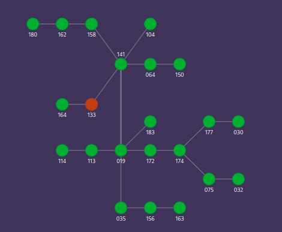

# NDiagrams

O **NDiagrams** é uma ferramenta que desenvolvi para solucionar um problema específico na administração de redes de um provedor de acesso onde sou o responsável técnico. Não encontrei uma solução open source ou gratuita que atendesse às minhas necessidades, então decidi criar minha própria ferramenta para monitoramento de rede.

## O Problema

Atualmente, há ótimas ferramentas de monitoramento de rede no mercado, como **Zabbix** e **Prometheus**. No provedor que gerencio, utilizo o Zabbix para monitorar a rede e receber alertas de incidentes. Contudo, ao lidar com **múltiplos POPs** (Point of Presence), a gestão se torna complexa, especialmente em situações de incidentes massivos. Por isso, um mapa que represente visualmente a rede com **cores indicativas** é crucial para uma gestão eficiente. Infelizmente, não encontrei uma ferramenta que atendesse completamente a essa necessidade.

## A Solução

Com mais de **1000 equipamentos** na rede e mais de **100 POPs**, criar um mapa visual da rede se tornou essencial. A ideia foi **agrupar os equipamentos por POPs**, criando grupos de hosts no Zabbix e exibindo esses grupos em um mapa, onde cada POP é representado por um círculo. As **cores dos círculos** correspondem às mesmas severidades apresentadas no Zabbix, conforme a tabela abaixo:

| Classificação     | Cor            |
|-------------------|----------------|
| Não classificado  | Cinza          |
| Informação        | Azul claro     |
| Aviso             | Amarelo        |
| Média             | Laranja        |
| Alto              | Vermelho claro |
| Desastre          | Vermelho       |

> Atualmente, a única cor suportada é o vermelho, atribuída às severidades Média, Alto e Desastre.

### Exemplo de Mapa

Segue um exemplo fictício de um mapa de rede gerado pela ferramenta:



> No exemplo acima, utilizei números, mas também é possível usar nomes alfanuméricos.

## Tecnologias Utilizadas

O projeto foi desenvolvido em **React**, utilizando o [react-network-diagrams](https://github.com/esnet/react-network-diagrams), criado pelo [ESnet Portal](https://my.es.net). Ao explorar esse projeto, percebi a flexibilidade que ele oferece para customizações. O **NDiagrams** é essencialmente uma combinação desse pacote com dados fornecidos pelo **Zabbix**, exibindo o estado da rede em um mapa visual.

## Como Instalar

1. Clone o repositório:

    ```bash
    git clone https://github.com/dionialves/ndiagrams.git
    ```

2. Acesse a pasta do projeto e instale as dependências:

    ```bash
    npm install
    ```

3. Edite o arquivo `app/src/zabbix_api/api.conf`, inserindo as informações de **URL**, **USER** e **PASSWORD** para conexão com o servidor Zabbix.

4. Instale o pacote **PM2** para gerenciar a API em segundo plano:

    ```bash
    npm install pm2
    ```

5. Inicie a comunicação com o Zabbix:

    ```bash
    pm2 start app/src/zabbix_api/api.js --name zabbix-api
    ```

    Isso permitirá que o app colete dados do Zabbix em segundo plano e exiba o mapa com as informações.

6. Acesse o projeto no navegador em `http://localhost:3000`. Caso queira rodar o app em segundo plano, execute:

    ```bash
    pm2 start npm --name "NDiagrams" -- start
    ```

### Customização do Mapa

O projeto gera um mapa básico como demonstração. Para personalizar o mapa, edite o arquivo `app/src/topology/topology.js`. Nele, você pode adicionar **nodes** e **edges** para construir seu mapa de rede. Os valores `x` e `y` determinam a posição dos nodes no mapa.

## Próximos Passos

Há diversas melhorias planejadas para o futuro:

- Implementar o suporte completo a todas as cores de severidade no mapa;
- Permitir a edição do mapa diretamente pelo navegador;
- Habilitar a criação de múltiplos mapas;
- Melhorar a interface web para criar, editar e visualizar os mapas;
- Integrar o NDiagrams com outras ferramentas de monitoramento;
- Adicionar docker.
